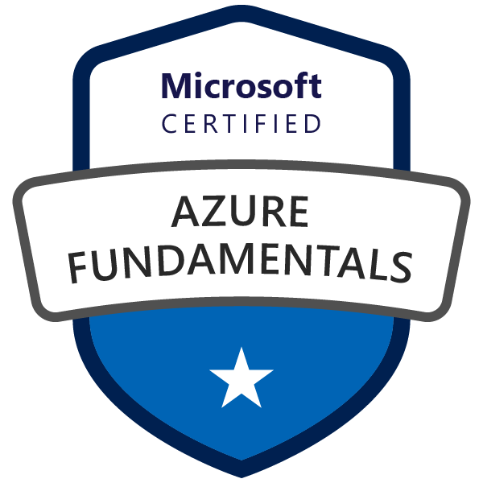
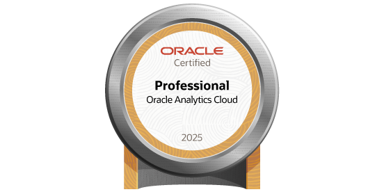
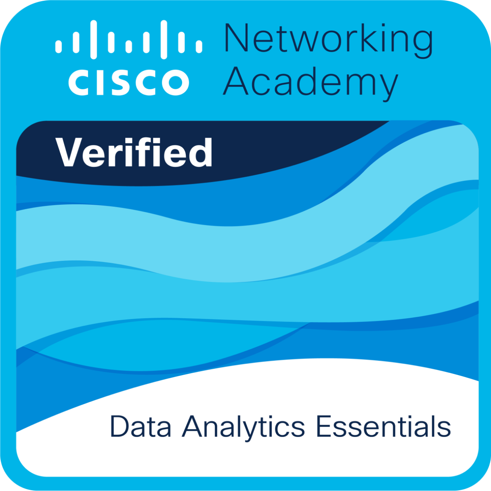

<h1 align="center">Hi 👋, I'm Vikas Morabagi</h1>
<h3 align="center">Data Analyst | SQL | Python | Power BI | Turning Data into Business Impact</h3>

  
  
  

---

## 🚀 About Me

Detail-oriented Data Analyst with hands-on experience in:

- SQL-based data extraction & optimization  
- Python-powered Exploratory Data Analysis (EDA)  
- Power BI dashboard development & KPI tracking  
- Data modeling (Star Schema) & DAX measures  
- Business-driven problem solving  

I focus on transforming raw datasets into **clear, strategic insights that improve decision-making and ROI**.

---

## 🛠 Tech Stack

### 👨‍💻 Languages

### 🗄 Databases

### 📊 BI & Visualization

### ⚙ Tools

---

# 📊 Featured Projects

---

## 📌 Meta Advertising Insights Dashboard
**Power BI | SQL | DAX**

✔ Identified conversion gap (13.56% engagement vs 0.61% purchases)  
✔ Found Video Ads & Female 18–30 as highest ROI segment  
✔ Recommended regional budget reallocation (India & USA)  
✔ Built Star Schema model + advanced DAX metrics (ROAS, CTR)

**Impact:** Improved marketing budget efficiency & funnel optimization.

---

## 📌 Telecom Customer Churn Analysis
**Python | Pandas | Seaborn**

✔ Analyzed 7,043 customers with 26.5% churn rate  
✔ Found 88.5% churners on month-to-month contracts  
✔ Identified Tech Support as retention driver  

**Impact:** Strategic migration plan to long-term contracts & targeted retention.

---

## 📌 Netflix SQL Data Analysis
**PostgreSQL**

✔ 8,800+ titles dataset  
✔ Used CTEs, Window Functions, Aggregations  
✔ Solved 15+ business-focused queries  
✔ Identified global content trends & regional growth patterns  

**Impact:** Data-backed recommendations for regional content expansion.

---

## 🏆 Certifications

<table align="center">
<tr>
<td align="center" width="220">

 

**Microsoft Certified**
Azure Fundamentals

</td>

<td align="center" width="220">

 

**Oracle Certified**
Analytics Cloud 2025 Professional

</td>

<td align="center" width="220">

 

**Cisco Networking Academy**
Data Analytics Essentials

</td>

</tr>
</table>

--- 

# 🎯 What I Bring

✔ Strong SQL Querying & Optimization  
✔ Business-Focused Data Analysis  
✔ KPI Dashboard Design  
✔ Structured Analytical Thinking  
✔ Clear Data Storytelling  

---

# 📬 Let’s Connect

📍 Pune, Maharashtra  
📧 vikasmora9080@gmail.com  
🔗 linkedin.com/in/vikas-morabagi  
💻 github.com/VikasMorabagi01  

---

⭐ If you like my work, feel free to connect or collaborate!
